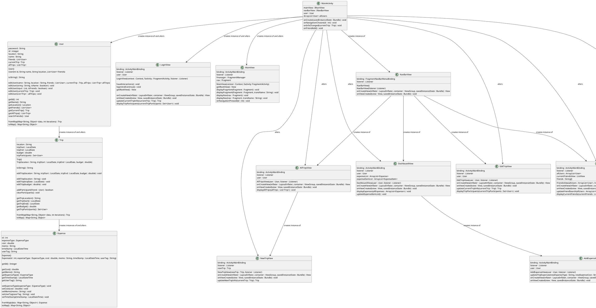

```plantuml


@startuml
'hide circle
'hide empty methods

' classes

class MainActivity{
    mainView : IMainView
    navBarView : INavBarView
    user : User
    ArrayList<User> allUsers
    
    onCreate(savedInstanceState : Bundle) : void
    onNavigationChosen(id : int) : void
    onInfoChanged(currentTrip : Trip) : void
    onFriendAdd() : void
}

class User{
    password : String
    id : integer
    location : String
    name : String
    friends : List<User>
    currentTrip : Trip
    allTrips : List<Trip>
    
    User()
    User(int id, String name, String location, List<User> friends)
    
    toString() : String
    
    editUser(name : String, location : String, friends : List<User>, currentTrip : Trip, allTrips : List<Trip> allTrips)
    editUser(string : String, isName : boolean) : void
    editUser(input : List, isFriends : boolean) : void
    editUser(currentTrip : Trip) : void
    editUser(List<Trip> : allTrips) : void
    
    getId() : int
    getName() : String
    getLocation() : Location
    getFriends() : List<User>
    getCurrentTrip() : Trip
    getAllTrips() : List<Trip>
    searchFriends() : User

    fromMap(Map<String, Object> data, int iterations) : Trip
    toMap() : Map<String, Object>
}

class Trip{
    location : String
    tripStart : LocalDate
    tripEnd : LocalDate
    budget : double
    tripParticipants : Set<User>
    
    Trip()
    Trip(location : String, tripStart : LocalDate, tripEnd : LocalDate, budget : double)
    
    toString() : String
    
    editTrip(location : String, tripStart : LocalDate, tripEnd : LocalDate, budget : double) : void
    
    editTrip(location : String) : void
    editTrip(tripDate : LocalDate) : void
    editTrip(budget : double) : void
    
    addParticipant(friend : User) : boolean
    clearParticipants() : void
    
    getTripLocation() : String
    getTripStart() : LocalDate
    getTripEnd() : LocalDate
    getBudget() : double
    getTripParticipants() : Set<User>

    fromMap(Map<String, Object> data, int iterations) : Trip
    toMap() : Map<String, Object>
    
}

class Expense {
    id : int
    expenseType : ExpenseType
    cost : double
    memo : String
    timeStamp : LocalDateTime
    userTag : String

    Expense()
    Expense(id : int, expenseType : ExpenseType, cost : double, memo : String, timeStamp : LocalDateTime, userTag : String)

    getId() : Integer

    getCost() : double
    getMemo() : String
    getExpenseType() : ExpenseType
    getTimeStamp() : LocalDateTime
    getUserTag() : String

    setExpenseType(expenseType : ExpenseType) : void
    setCost(cost : double) : void
    setMemo(memo : String) : void
    setUserTag(userTag : String) : void
    setTimeStamp(timeStamp : LocalDateTime) : void

    fromMap(data : Map<String, Object>) : Expense
    toMap() : Map<String, Object>
}

class LoginView {
    binding : ActivityMainBinding
    listener : Listener
    user : User

    LoginView(context : Context, factivity : FragmentActivity, listener : Listener)

    haveInteractions() : void
    loginAndContinue() : void
    getRootView() : View

    onCreateView(inflater : LayoutInflater, container : ViewGroup, savedInstanceState : Bundle) : View
    onViewCreated(view : View, savedInstanceState : Bundle) : void
    updateCurrentTripInfo(currentTrip : Trip) : Trip
    displayTripParticipants(currentTripParticipants : Set<User>) : void
}

class MainView {
    binding : ActivityMainBinding
    listener : Listener
    fmanager : FragmentManager
    nav : Fragment
    
    MainView(context : Context, factivity: FragmentActivity)
    getRootView() : View
    displayFragment(fragment : fragment) : void
    displayFragment(fragment : Fragment, transName : String) : void
    displayNav(nav : Fragment) : void
    displayNav(nav : Fragment, transName : String) : void
    onNavigationPressed(id : int) : void
}

class NavBarView {
    binding : FragmentNavBarMenuBinding
    listener : Listener
    
    NavBarView()
    NavBarView(listener: Listener)
    onCreateView(inflater : LayoutInflater, container : ViewGroup, savedInstanceState : Bundle) : View
    onViewCreated(view : View, savedInstanceState : Bundle) : void

}

class EditTripView {
    binding : ActivityMainBinding
    listener : Listener
    user : User

    EditTripView(user : User, listener : Listener)
    onCreateView(inflater : LayoutInflater, container : ViewGroup, savedInstanceState : Bundle) : View
    onViewCreated(view : View, savedInstanceState : Bundle) : void
    updateCurrentTripInfo(currentTrip : Trip) : Trip
    displayTripParticipants(currentTripParticipants : Set<User>) : void
    
}

class AddExpenseView {
    binding : ActivityMainBinding
    listener : Listener
    user : User

    AddExpenseView(user : User, listener : Listener)
    updateTripExpenses(newExpenseType : String, newExpenseCost : String, newExpenseMemo : String, currentTrip : Trip) : Trip
    onCreateView(inflater : LayoutInflater, container : ViewGroup, savedInstanceState : Bundle) : View
    onViewCreated(view : View, savedInstanceState : Bundle) : void
}

class NewTripView {
    binding : ActivityMainBinding
    listener : Listener
    newTrip : Trip

    NewTripView(newTrip : Trip, listener : Listener)
    onCreateView(inflater : LayoutInflater, container : ViewGroup, savedInstanceState : Bundle) : View
    onViewCreated(view : View, savedInstanceState : Bundle) : void
    updateNewTripInfo(currentTrip : Trip) : Trip

}

class AllTripsView {
    binding : ActivityMainBinding
    listener : Listener
    user : User

    AllTripsView(user : User, listener : Listener)
    onCreateView(inflater : LayoutInflater, container : ViewGroup, savedInstanceState : Bundle) : View
    onViewCreated(view : View, savedInstanceState : Bundle) : void
    displayAllTrips(allTrips : List<Trip>) : void
}

class DashboardView {
    binding : ActivityMainBinding
    listener : Listener
    user : User
    expenseList : ArrayList<Expense>
    expenseItemList : ArrayList<ExpenseItem>

    DashboardView(user : User, listener : Listener)
    onCreateView(inflater : LayoutInflater, container : ViewGroup, savedInstanceState : Bundle) : View
    onViewCreated(view : View, savedInstanceState : Bundle) : void
    displayExpenses(allExpenses : ArrayList<Expense>) : void
    updateExpenseItemList() : void
}

class FriendsView {
    binding : ActivityMainBinding
    listener : Listener
    allUsers : ArrayList<User>
    currentFriendsView : ListView
    friends : String[]

    FriendsView(allUsers : ArrayList<User>, listener : Listener)
    onCreateView(inflater : LayoutInflater, container : ViewGroup, savedInstanceState : Bundle) : View
    onViewCreated(view : View, savedInstanceState : Bundle) : void
    updateFriendSearch(allUsers : ArrayList<User>) : void
    displayCurrentFriends(currentFriends : List<User>) : void
    
}

' associations
MainActivity --> LoginView : creates instance of and alters
MainActivity --> MainView : creates instance of and alters


MainActivity --> NavBarView : creates instance of
NavBarView --> DashboardView : creates instance of
NavBarView --> EditTripView : creates instance of
NavBarView --> FriendsView : creates instance of
NavBarView --> AllTripsView : creates instance of
DashboardView --> AddExpenseView : creates instance of
AllTripsView --> NewTripView : creates instance of
MainActivity --> DashboardView : alters
MainActivity --> EditTripView : alters
MainActivity --> FriendsView : alters
MainActivity --> AllTripsView : alters
MainActivity --> AddExpenseView : alters
MainActivity --> NewTripView : alters

MainActivity --> User : creates instance of and alters
User --> Trip : creates instance of and alters
Trip --> Expense : creates instances of and alters
@enduml

```