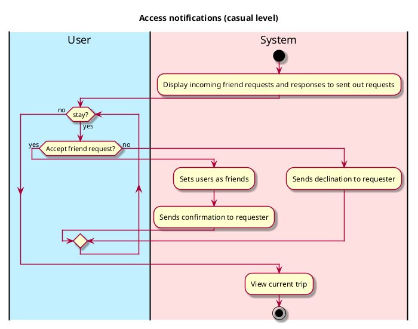

# Access Notifications (Not Implemented)

## 1. Primary actor and goals
_User_: wants to view and accept or deny friend requests, quickly accurately, and safely.

## 2. Other stakeholders and their goals

## 3. Preconditions
User is identified and authenticated.

## 4. Postconditions
* Changes to their friends list are saved

## 5. Workflow

