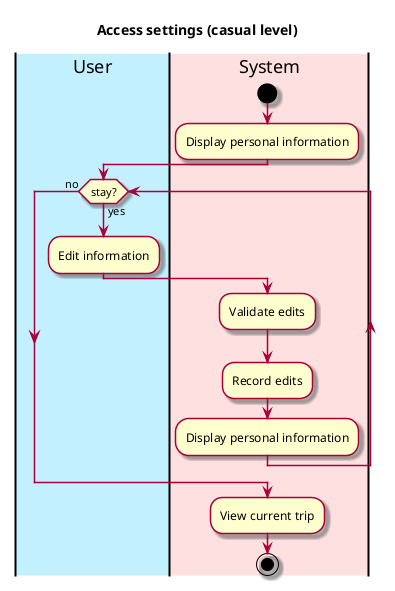

# Access Settings (Not Implemented)

## 1. Primary actor and goals
_User_: wants to view and edit their personal information. Wants fast, accurate information, and the ability to quickly and easily change it.

## 2. Other stakeholders and their goals

## 3. Preconditions
User is identified and authenticated.

## 4. Postconditions
* Changes to their personal information are saved

## 5. Workflow

