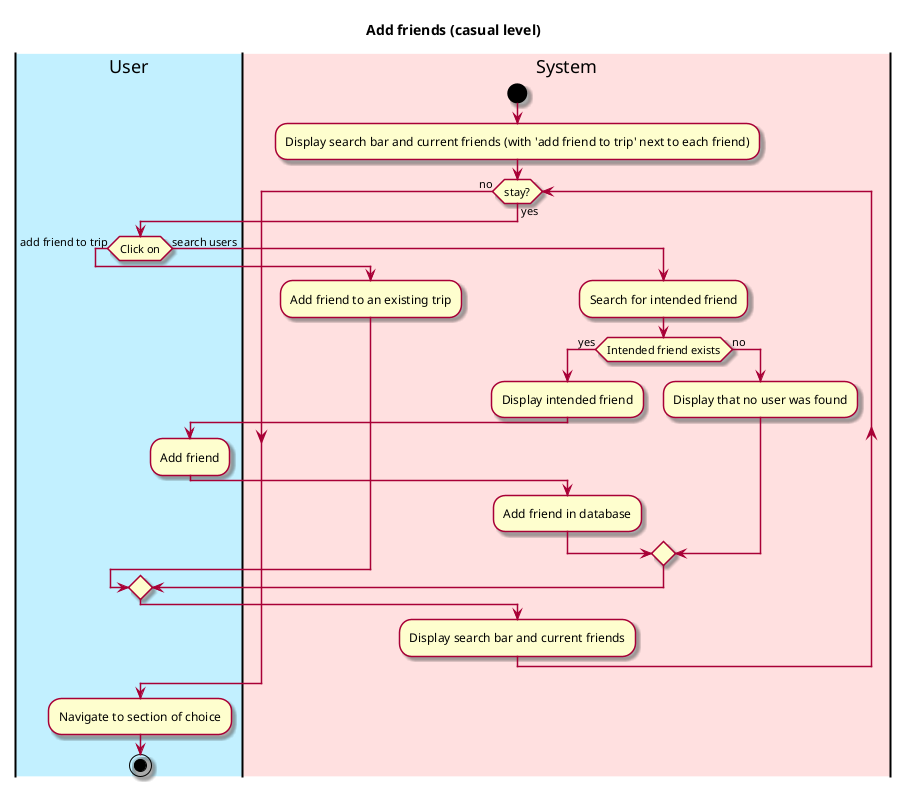
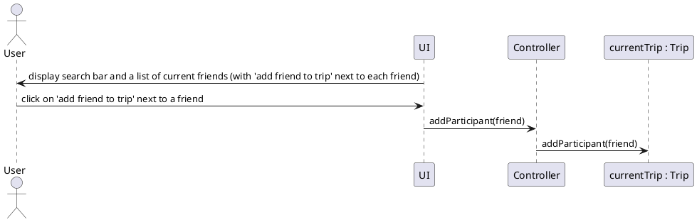

# Add Friends

## 1. Primary actor and goals
_User_: wants to connect and become friends with other user of the app. Wants fast, accurate connections, and safety while interacting.

## 2. Other stakeholders and their goals

## 3. Preconditions
User is identified and authenticated.

## 4. Postconditions
* Changes to user's friends list is updated

## 5. Workflow

# Sequence Diagram

