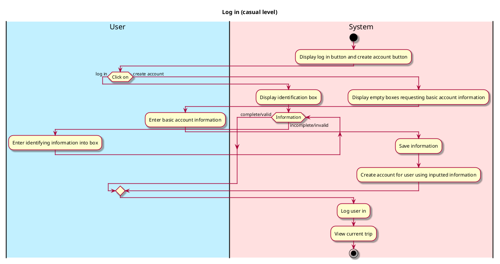

# Log In

## 1. Primary actor and goals
_User_: wants to log in to the app, quickly, easily, and effectively.

## 2. Other stakeholders and their goals

## 3. Preconditions
User has entered the app.

## 4. Postconditions
* Changes to their personal information are saved

## 5. Workflow

