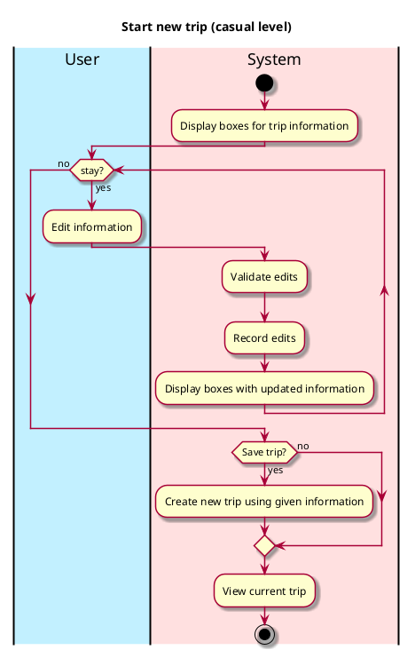
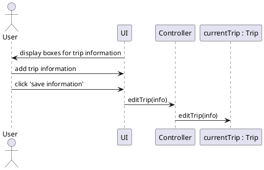

# Start New Trip

## 1. Primary actor and goals
_User_: wants to start a new trip, quickly and easily. Wants easily modifiable information that is safe and well displayed.

## 2. Other stakeholders and their goals

## 3. Preconditions
User is identified and authenticated.

## 4. Postconditions
* Their new trip information is saved

## 5. Workflow

# Sequence Diagram

