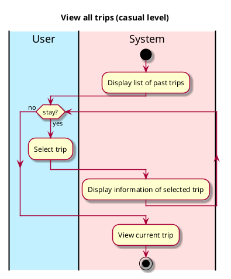

# View All Trips

## 1. Primary actor and goals
_User_: wants to view and possibly edit any trip's information. Wants fast, accurate information.

## 2. Other stakeholders and their goals

## 3. Preconditions
User is identified and authenticated.

## 4. Postconditions

## 5. Workflow

The all trips section shows information about trips, including what friends are/were part of the trip, the trip's budget, and the locations, activities, and methods of transport of the trip.