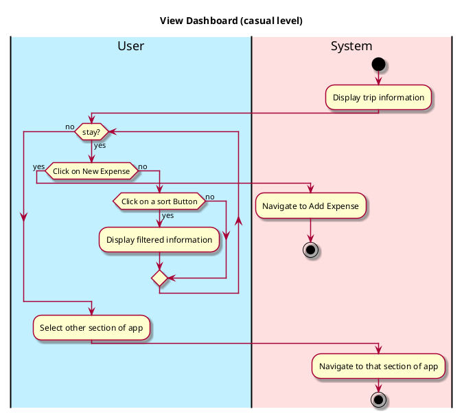
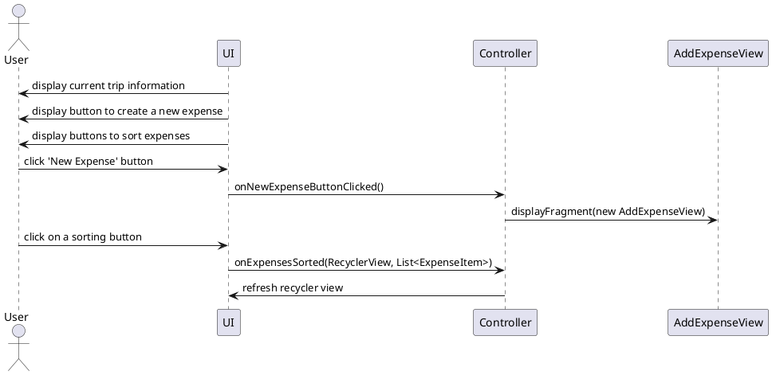

# View Dashboard

## 1. Primary actor and goals
_User_: wants to view their current trip and add expenses to their trip. Wants fast, accurate information with ability to sort data.

## 2. Other stakeholders and their goals

## 3. Preconditions
User is identified and authenticated.

## 4. Postconditions
* Changes to their trip information are saved

## 5. Workflow

# Sequence Diagram

