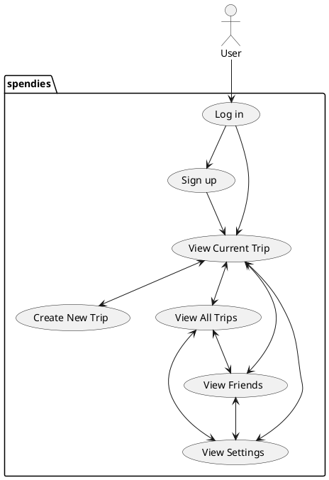

# Spendies app - Vision document

## 1. Introduction

We envision an app for travelers to create budget-friendly trip itineraries and split group expenses over the course of a vacation.

## 2. Business case
The app features a social component that allows users to invite others to a trip. Other features include viewing past trips, establishing a group budget, trip drafting, categorization of expenses, currency exchange rates, an automated spending tracker, and budget-conscious activity recommendations.

## 3. Key functionality
- Solo and group itinerary creation with friend system
- Budget configuration and budget-conscious recommendations
- Expense tracking and categorical visualization

## Use case planning
1. Login / Create Account
    Credential Matching
    Account Creation with Email/Phone Number and Password
2. View Current Trip (TripActive)
    a. (True) Display expense chart / Display entries as list, Add entry, Participants (if group trip)
    b. (False) Display placeholder text (i.e. "No data"), Create new trip
3. Create New Trip
4. View All Trips
5. View Friends
6. View Settings

1. A user opens the app
2. They go to the login page
3a. If they are a returning user, they send their login info to a server that will check with a database to confirm that the credentials match
4a. If they match, the user is successfully logged in and sent to the current trip screen.
3b. If they are a new user, they are prompted to create a profile, with an email or a phone number, and a password
4b. Their credentials are sent to a database, their account is flagged if they have not finished setting up their profile, and they are logged in and sent to the current trip screen.
5. The current trip screen will either display a dashboard for a current trip, or will remain blank if there is no current trip. Via the bottom navigation bar, the user will have the option to create a new trip, view all trips, view current trip, view friends, or view settings.

6. From the settings page, they can edit their credentials or other app-related preferences.
7. If they go to friends, they can choose to add another user and are prompted to look up a phone number
8. If their phone number exists in the database, the phone number holder is sent a join request
9. They can accept on their end
10. Friends can be invited to trips
11. Once the trip has been created, the user is prompted to set up a budget, trip length, and location
12. If they view a past trip, a dashboard of that trip will pop up.

## 4. Stakeholder goals summary
- **User**: trip planning, budget-conscious spending, split group expenses
- **Database system**: store and handle user data, accumulate itineraries to recommend to users in the future

## Use case diagram

